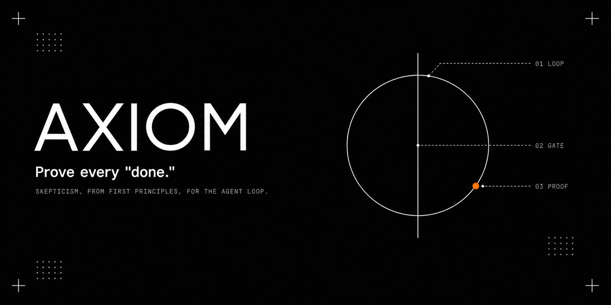

# Axiom



**Trust nothing unaudited — including yourself.**

Declare the evidence before the work begins. When your agent says *"done,"*
Axiom checks the claim against it — not against the conversation.

Axiom is the working discipline for long-running coding agents: one act of
verification at each station of the loop, on the official
[Claude Code](https://code.claude.com/docs/en/hooks) hook API — plus native
adapters for Codex CLI, hermes-agent, and OpenClaw. The part that ships as
deterministic enforcement today is the **Execute** station; every other
station is labeled below with exactly the form it ships in, and nothing is
labeled as installed behavior until it is.

**Axiom itself makes no network calls, needs no API key, sends no telemetry,
and puts no model in the verification path** — Python stdlib only, all local.
(The one thing that reaches outward is a `cmd_succeeds` predicate: it runs the
command *you declared*, with your permissions — fresh execution, not a
sandbox.) What it deliberately does *not* catch is enumerated in
[What this won't catch](#what-this-wont-catch).

## Install

```
/plugin marketplace add <owner>/axiom     # <owner> is filled in at publication
/plugin install axiom@axiom
```

Until then, point the marketplace at a local clone:
`/plugin marketplace add /path/to/axiom` — or just run
[`./scripts/demo.sh`](scripts/demo.sh), which needs no install at all.

Every rule installs in **observe mode**: it records what it *would* have
blocked and blocks nothing. You turn on enforcement per rule, when its
findings have earned it — Axiom never switches itself on.

## See it catch a lie

`./scripts/demo.sh` runs this in a throwaway directory in about 30 seconds —
no Claude Code session needed, nothing of yours touched. Same hook, same
evaluator, same decision JSON Claude Code acts on:

```
1. You declare the evidence BEFORE the work — a goal file in the project.

    ## acceptance
    [{"type": "file_exists", "path": "src/auth.py"},
     {"type": "cmd_succeeds", "cmd": ["python3", "-m", "unittest", "discover", "-s", "tests"]}]

2. SessionStart registers the claim (baseline snapshotted now, not later).

3. The agent does some work and says: "Done — auth is fixed, tests pass."

4. The turn tries to end. Axiom re-runs the declared evidence itself:

    decision: block
    reason:   AXIOM write verification failed: cmd_succeeds ['python3', '-m', 'unittest', 'discover', '-s', 'tests']: expected fresh command exits 0, actual exit 1. Fix the declared artifact or verification command, then stop again. Escape hatch: /axiom:enforce off write-verify

    The turn does not end. The agent gets the failure and keeps working.
    Note: the file EXISTS and the agent SAID tests pass — Axiom ran them.

5. The agent actually fixes it. Same claim, same evidence, re-run:

    no decision — the claim passed, the turn ends, the claim is cleared.
```

The demo forces enforce mode to show the block; on a real install that finding
would be recorded, not blocked, until you say otherwise.

---

## The one idea

A coding agent's output is testimony, not proof. In a single interactive
session you are the check — you read what came back. In a
[loop](https://addyosmani.com/blog/loop-engineering/) — where the agent runs
unattended, prompted by a schedule or a `/goal` condition instead of by you —
nobody is reading. The agent's "done" becomes the premise of the next step,
and a false one compounds silently.

Claude Code's own `/goal` closes a loop on a stopping condition, and a small
model judges whether you're done — but [that judge reads the conversation, not
the filesystem](https://code.claude.com/docs/en/hooks): *done is a claim, not
a proof.* Axiom is the missing half: it checks the claim against the
environment.

The predicates themselves are decades-old primitives — exists, regex, hash,
exit code — **on purpose**. What's new is where they live: declared before
the work, snapshotted into a baseline at registration, held across sessions
as a claim with an identity, and re-verified through a fresh evidence channel
at the loop boundary. Old checks, new custody chain.

The evaluator and the claim lifecycle are host-agnostic Python; the Claude
Code hooks are the **first adapter, not the product**. The adapter contract —
three verbs any agent runtime can wire — is frozen in
[docs/ADAPTERS.md](docs/ADAPTERS.md), and four runtimes ship against it today:
Claude Code, [Codex CLI](https://github.com/openai/codex),
[hermes-agent](https://github.com/NousResearch/hermes-agent), and
[OpenClaw](https://github.com/openclaw/openclaw). Each adapter was verified
against its host's *real* consumption seam — the function or process boundary
the host actually calls — not against its documented hook shape; the evidence
table and the verified host versions are in ADAPTERS.md. The calibration
corpus behind Axiom's thresholds already spans two runtimes — multi-runtime is
where this tool came from, and the adapters are the packaging catching up to
the data.

## What it does, across the loop

Axiom is not an orchestrator — Claude Code already ships the loop primitives
(scheduling, worktrees, skills, subagents, `/goal`). Axiom's design places
one act of verification at each station of that loop. The last column is the
honest part: it says what each row ships as **today** — `hook` is running
code that acts on your turn, `template` is a convention you follow, `library`
is opt-in and not wired into the runtime, `roadmap` is not written.

| Loop station | The unverified claim | Axiom's check | Ships as |
|---|---|---|---|
| **Plan** (forge a goal) | "this plan is right" | a first-principles skeptic lane + pre-mortem, reconciled against experience before the plan is accepted | template |
| **Execute** | "I finished it" | `write-verify` — completion is checked against **declared evidence predicates** (files, git, fresh command runs), never inferred from a dirty working tree | **hook** |
| | "one more fix will work" (x8) | `stuck-search` — failures are fingerprinted across attempts; at threshold it injects stop-retrying + search-externally guidance | **hook** |
| **Review** | "the code is fine" (said by the coder) | the producer never signs off on itself; risk-rated work gets an independent, cross-family reviewer | roadmap |
| **Evolve** | "the machine learned a better rule" | routing/threshold changes are proposed to a ledger a **human approves** — never written by an unattended loop | roadmap |
| **Remember** | "this recalled memory is current & safe" | every lesson carries a timestamp + source and an *unverified-memory* prefix; instruction-shaped imports are quarantined | library |
| **Record** | "we'll remember why we did this" | closeout leaves a worklog + decision record; not left to the context window | template |

`cmd_succeeds` is fresh execution: its child process inherits the invoking
user's permissions, environment, `PATH`, network, and filesystem. Argv-only
execution, the executable allowlist, metacharacter rejection, and the timeout
reduce injection surface; they are not a security boundary.

**What actually ships in v1** (expanding the table's last column — the design
is the whole table; the installed behavior is exactly this):

- **Ships now, as runtime hooks:** the **Execute** checks (`write-verify`,
  `stuck-search`) and the guardrails (`schema-guard`, `preflight`).
- **Ships now, as discipline + templates:** **Plan** (goal template with the
  skeptic lane) and **Record** (worklog/decision-record convention).
- **Ships now, as an opt-in library, not a runtime backend:** the provider
  layer for write verification and **Memory**; predicate evaluation is shared
  with the runtime hooks.
- **Roadmap (not in v1):** independent-reviewer wiring, and **Evolve** — the
  human-approved self-calibration engine (the observe-mode ledger already
  collects its input; the engine itself is staged). See
  [Capability tiers](#capability-tiers).

## Disciplined self-evolution

The reason "self-improving agents" tend to rot is that they rewrite their own
rules unattended — one bad generalization poisons every later decision.
Frameworks that do this at scale exist and are popular; that does not make it
safe.

Axiom's stance: **paths are free, goals are human-locked, rules are
human-approved.** The agent may change *how* it reaches a fixed goal
(that's optimization, and every change leaves a changelog line). It may not
silently change *what* the goal is (that's a collapsed premise — it escalates
to you), nor rewrite its own routing/thresholds (that goes through a proposal
you approve). Self-evolution, with a discipline on it.

## Human-in-the-loop, concretely

"Human approval" is worthless as an adjective, so here is exactly where the
human is in v1 — no more than that:

- **Nothing enforces until you say so.** Every rule starts in observe mode.
  That is the gate: the default is *record, don't act*, and Axiom never
  promotes itself.
- **The decision is one command, and it is logged.**
  `/axiom:enforce write-verify on` flips one rule and writes a `mode_changed`
  event to the ledger with who decided and what it changed from. The tool's
  decisions and its operator's decisions land in the same `grep`-able file —
  auditing only the machine's half would be auditing the wrong half.
- **What it would have done is on disk before it does anything.**
  `/axiom:report` reads the ledger; `would_have_blocked` events carry the
  failed predicate and a timestamp. You approve enforcement against evidence
  from your own loops, not against this README.
- **Goal files are yours, on disk, in git.** `done_criteria` and `changelog`
  live in the repo — `git diff` is the audit trail, with no separate system to
  trust.

Approval has to cost near-zero (read one line, type one command) or people
route around it. That constraint is why there is no approval queue in v1.

**Not shipped, and not claimed:** a proposals queue for machine-suggested rule
changes (that is the [Evolve](#capability-tiers) station — the ledger collects
its input, the engine is not written), and the fail-closed egress gate
sketched in [docs/privacy-egress-design.md](docs/privacy-egress-design.md)
(a design note; the working implementation is coupled to a private knowledge
base and is not part of v1). `preflight` **advises, it does not block** — it
injects the recovery/scope questions as context and records the finding.

## Zero-risk trial

```
/plugin marketplace add <owner>/axiom
/plugin install axiom@axiom
```

On install, every hook is in **observe mode**: it records what it *would*
have done and blocks nothing. After a few days:

```
/axiom:report
== Findings by rule ==

[write-verify] would-have-blocked: 3
  last incidents:
    fix auth bug | file_exists src/auth.py: expected file exists, actual missing | 2026-07-10T09:14Z

[schema-guard] would-have-blocked: 1

== Coverage ==
heartbeat days: 6
```

Each `would-have-blocked` is a real incident with the failed predicate and
timestamp — enable blocking once you trust them: `/axiom:enforce write-verify on`.

If it caught nothing, that's an honest result — your loops are clean. Remove
it and move on: `/axiom:uninstall` enumerates and deletes the files this
plugin manages. (The host keeps plugin *cache* copies for a grace period;
Claude Code manages those, not us — we don't claim to erase what we don't
control.)

## Born from incidents

None of these thresholds are guesses. Each hook exists because a specific
failure cost real time in months of daily long-horizon agent operation:

- **write-verify** ← agents reporting "done" on work that never touched disk,
  including a memory system that reported healthy for 13 days while silently
  not writing.
- **stuck-search** ← a full night burned retrying an environment failure that
  had a verbatim fix sitting in a forum thread.
- **preflight** ← an unmemory-verified destructive command that took a machine
  down.

The full taxonomy is in [docs/failure-modes.md](docs/failure-modes.md). What
open-source ships in this space is either a methodology essay or a feature
list; this is the residue of post-mortems.

## Capability tiers

Axiom unlocks with your setup — nothing is forced on:

- **L0 (zero-config):** the verification hooks, observe-mode by default. Works
  the moment you install.
- **L1 (cost-routing):** if you run a multi-model setup (e.g.
  [CCR](https://github.com/musistudio/claude-code-router)) or an external
  agent CLI, the routing table + dispatch discipline apply — today as the
  template and convention in `templates/`, not as runtime code.
- **L2 (evolve):** once the ledger has enough samples, threshold
  self-calibration proposes changes for you to approve. *(Not shipped. The
  observe-mode ledger already collects its input; the engine is not written,
  and there is no config surface for it in v1.)*

## Memory: bring your own

Axiom's default memory is a local `lessons.md` the plugin manages. Writing to
Claude Code's own on-disk memory is an explicit opt-in (`memory_provider =
"memory_md"`), not the default. The provider layer is the extension point — it
is not wired into the runtime hooks by default; point it at a real knowledge
base — e.g.
[GBrain](https://github.com/garrytan/gbrain), an open-source brain layer — for
graph-backed recall and write-verification receipts. The provider interface is
not theoretical: the author runs these hooks in production against exactly such
a self-hosted store.

## Why not just `/goal`?

`/goal` tells you *when to stop*. Axiom tells you *what happened*. `/goal`'s
completion judge reads the conversation and resets its baselines on
`--resume`; Axiom's goal files are on-disk, structured (`done_criteria` /
`route` / `changelog`), survive session loss, and are diffed against real
evidence at closeout. They stack: run `/goal` inside a task; let the goal file
own *what done means*. Single-session, throwaway work? `/goal` alone is enough
— forging a goal file for it is overhead, and Axiom says so.

## Prior art & related work

We ran a competitive scan before first release. Claims about neighbors are
held to the same evidence bar as claims about ourselves — each entry cites the
project's own docs with an access date:

- [groundtruth](https://github.com/vnmoorthy/groundtruth) — a Stop-hook
  completion-claim gate, the closest project to our flagship, and **ahead of
  us** on empirical calibration (1,272 real turns). It detects evidence in the
  same turn; Axiom pre-declares predicates with a baseline and a cross-session
  claim lifecycle.
- [claimcheck](https://github.com/ojuschugh1/claimcheck) — a post-hoc CLI that
  auto-extracts claims from transcripts. Its extraction is broader than our
  declared-predicate contract; that method is credited on our v1.2 roadmap.
- [tdd-guard](https://github.com/nizos/tdd-guard) — enforces a *different*
  discipline (TDD) at the same hook level, and marks the other side of a design
  split: it asks a model whether the work complies; we re-run predicates with
  no model in the path. Different costs, not a ranking.
- [nah](https://github.com/manuelschipper/nah) — deterministic permissions at
  PreToolUse. Complementary station (should this *run*? vs did what you said
  happen actually *happen*?), and the bar we haven't met: it calibrates on a
  **public** corpus (101,194 tool calls) where ours is private and n=1.
- [oh-my-claudecode](https://github.com/Yeachan-Heo/oh-my-claudecode) — much
  larger, sells multi-agent orchestration, and **does ship a narrow version of
  this**: a `Stop` hook that spots completion wording and blocks if the changed
  diff still holds TODO/stub/skipped-test markers. Same station, different
  question — it asks "did you leave junk in what you touched?", Axiom asks "did
  the specific thing you declared actually happen?" They compose.
- [planning-with-files](https://github.com/OthmanAdi/planning-with-files) —
  durable on-disk planning with an opt-in `Stop` gate that blocks on a plan
  still marked `in_progress`; the status string is agent-authored, which is the
  testimony we decline to trust. It also ships adapters for five-plus runtimes,
  so multi-runtime coverage is not our differentiator either.

Axiom independently derives from our own production incidents; where we took a
*method* from a neighbor, it is credited by name. Full comparison, access
dates, and what we adopted from whom: [docs/PRIOR-ART.md](docs/PRIOR-ART.md).

## Honest limits

- Thresholds are calibrated on one operator's workload (months of daily use,
  four execution lanes — varied, but n=1). A neighbor,
  [nah](https://github.com/manuelschipper/nah), calibrates on a public corpus;
  that is the better standard and we say so. Your mileage will differ — that's
  what observe mode is for, and published false-positive/false-negative rates
  are a v1.2 commitment, not a v1 claim.
- Claude Code's own roadmap is moving into this territory (hooks, `/goal`,
  `/code-review`). Axiom is designed to **ride that roadmap, not race it** —
  the hooks sit on the official hook API, the goal files sit above `/goal`.
  Where the platform absorbs a piece, you lose nothing you were depending on.

## What this won't catch

Axiom catches the **careless** false "done" — the common one, where an agent
reports success it never checked. It is not a seal against an agent actively
trying to get past it. If you need that, you need a sandbox; this is for the
loops you run outside one. The short version:

- **No claim, no check.** Nothing registered a claim? Stop records
  `unverified_completion` and the turn ends. Axiom verifies evidence *you
  declared* — it does not infer claims from the transcript.
- **A predicate is a letter, not a spirit.** `file_exists` passes on an empty
  file. Your predicates are the specification.
- **State sits at your agent's permission level.** An agent with write access
  can delete its own active claim. Axiom raises the cost of a false "done"
  from free to deliberate; it does not make it impossible.
- **One block per stop cycle, on purpose.** A failed claim blocks the stop
  once; if the agent immediately stops again (`stop_hook_active`), Axiom fails
  open and logs an `escalation`. A verifier that can wedge your agent forever
  is worse than no verifier. The claim stays active, so a *later* turn that
  still fails is blocked again — the cap is per re-entry, not per claim.
- **Observe mode blocks nothing.** That's the default, and the point.

The full threat model, the audited implementation boundaries, the remaining
hardening targets, and the n=1 calibration caveat:
[docs/KNOWN-LIMITATIONS.md](docs/KNOWN-LIMITATIONS.md). The rest of the
skeptic's list — *isn't this just a prompt? you didn't invent this. a sandbox
is the real answer. won't Anthropic build this in? stop hooks aren't reliable.
no benchmark, no evidence.* — is answered in [docs/FAQ.md](docs/FAQ.md).

## How this was built

Axiom was built with AI agents, under the discipline it ships. Claude Code
orchestrated; **OpenAI Codex wrote a substantial share of the code** and, on
every release, reviewed it adversarially as an independent second family;
Codex and DeepSeek scored the design against a
[frozen rubric](docs/REVIEW-RUBRIC.md) — the scoreboard, including a round we
voided for being ungrounded, is in that file. A human made every decision that
mattered and reviewed every change.

The rule we hold ourselves to: **the producer never signs off on itself.**
Before each release the whole diff goes to a cross-family reviewer whose
error modes are uncorrelated with the author's, and its findings are
adjudicated with evidence, not accepted on authority. That is not a courtesy —
it is the same principle as the plugin: a claim from the party that produced
the work is testimony, and testimony gets audited.

What that bought, concretely, and where to check it: a cross-family pass found
six contract-fidelity defects the author's own tests did not cover — five
fixed, one rejected with its reasons, each one written into the commit that
resolved it (`git log --grep="cross-family review"`). Two false-success
defects in the verification core itself — the exact failure class this tool
exists to catch — were found by review and fixed with regression tests before
first release (`git log --grep="resolve predicate paths identically"`). The
same review process caught a wrong claim about a neighbor in this repo's own
prior-art page, and the correction is recorded there rather than quietly
edited out.

## Testing

Every gate below runs in CI on every push: lint, types, the full suite on
three Python versions across Linux and macOS, the Node adapter tests, and a
privacy scan over tracked files.

Run the complete test suite through its canonical discovery command:

```sh
python3 -m unittest discover -s tests -v   # 115 tests
node --test adapters/openclaw/*.test.js    # 6 tests (OpenClaw adapter)
./scripts/demo.sh                          # the 30-second end-to-end demo
```

The legacy `python3 scripts/selftest.py` and
`python3 scripts/selftest_providers.py` commands remain as compatibility entry
points for their corresponding suites. CI uses canonical discovery, fails if it
collects zero tests, and fails if a shipped adapter's tests are not collected —
a quiet skip must never read as green.

## License

Apache-2.0. See [LICENSE](LICENSE).
